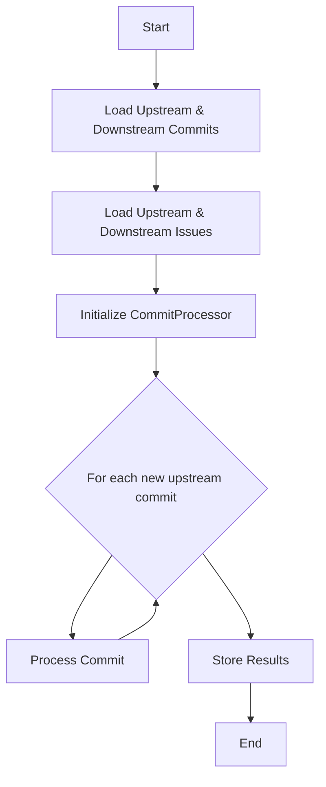
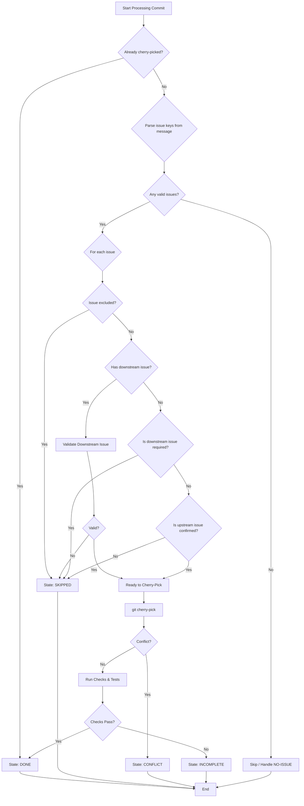
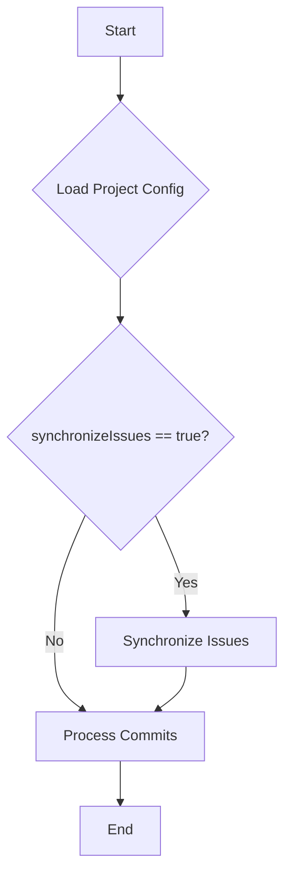
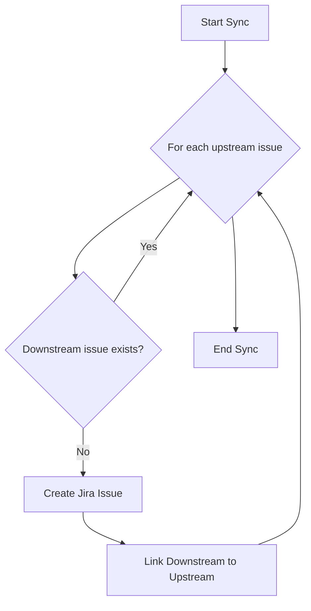

# Downstream Updater

This tool is used to update downstream projects based on upstream changes. It can synchronize commits and issues between Git repositories and issue trackers like GitHub and Jira.

## How to Use

### Prerequisites

*   Java 11
*   Maven
*   [yq](https://github.com/mikefarah/yq) (for running tests)
*   Git (with GPG signing disabled or configured)

### Building

To build the project, run the following command:

```bash
mvn clean package
```

This will create a `downstream-updater-1.0-SNAPSHOT-jar-with-dependencies.jar` file in the `target` directory.

### Running

To run the tool, use the following command:

```bash
java -jar target/downstream-updater-1.0-SNAPSHOT-jar-with-dependencies.jar [options]
```

### Running Tests

To run the tests, use the following command:

```bash
mvn test
```

### Command-Line Options

| Option                                      | Description                                                                                             | Required |
| ------------------------------------------- | ------------------------------------------------------------------------------------------------------- | -------- |
| `--user`                                    | The user, e.g., `dbruscin`.                                                                             | Yes      |
| `--project-config-repository`               | The project config repository, e.g., `https://gitlab.cee.redhat.com/amq/project-configs.git`.             | Yes      |
| `--project-config-repository-auth-string`   | The auth string to access project config repository.                                                    | Yes      |
| `--project-config-branch`                   | The project config branch, e.g., `main`.                                                                | Yes      |
| `--project-config-path`                     | The project config path, e.g., `amq-broker-distribution.yaml`.                                          | Yes      |
| `--project-stream-name`                     | The project stream name, e.g., `7.10`.                                                                  | Yes      |
| `--assignee`                                | The default assignee, e.g., `dbruscin`.                                                                 | No       |
| `--release`                                 | The release, e.g., `7.11.0.CR1`.                                                                        | No       |
| `--target-release-format`                   | The target release format, e.g., `AMQ %d.%d.%d.GA`.                                                     | No       |
| `--upstream-repository`                     | The upstream repository to cherry-pick from, e.g., `https://github.com/apache/activemq-artemis.git`.    | No       |
| `--upstream-repository-auth-string`         | The auth string to access upstream repository.                                                          | No       |
| `--upstream-branch`                         | The upstream branch to cherry-pick from, e.g., `main`.                                                  | No       |
| `--downstream-repository`                   | The downstream repository to cherry-pick to, e.g., `https://github.com/rh-messaging/activemq-artemis.git`. | No       |
| `--downstream-repository-auth-string`       | The auth string to access downstream repository.                                                        | No       |
| `--downstream-branch`                       | The downstream branch to cherry-pick to, e.g., `2.16.0.jbossorg-x`.                                     | No       |
| `--commits`                                 | The commits file.                                                                                       | No       |
| `--confirmed-commits`                       | The confirmed commits file.                                                                             | No       |
| `--payload`                                 | The payload file.                                                                                       | No       |
| `--confirmed-downstream-issues`             | The confirmed downstream issues.                                                                        | No       |
| `--excluded-downstream-issues`              | The excluded downstream issues.                                                                         | No       |
| `--confirmed-upstream-issues`               | The confirmed upstream issues.                                                                          | No       |
| `--excluded-upstream-issues`                | The excluded upstream issues.                                                                           | No       |
| `--upstream-issues-server-url`              | The server URL to access upstream issues, e.g., `https://issues.apache.org/jira/rest/api/2`.            | No       |
| `--upstream-issues-auth-string`             | The auth string to access upstream issues, e.g., `"Bearer ..."`.                                        | No       |
| `--upstream-issues-project-key`             | The project key to access upstream issues, e.g., `ARTEMIS`.                                             | No       |
| `--downstream-issues-server-url`            | The server URL to access downstream issues, e.g., `https://issues.redhat.com/rest/api/2`.               | No       |
| `--downstream-issues-auth-string`           | The auth string to access downstream issues, e.g., `"Bearer ..."`.                                      | No       |
| `--downstream-issues-project-key`           | The project key to access downstream issues, e.g., `ENTMQBR`.                                           | No       |
| `--downstream-issues-customer-priority`     | The customer priority to filter downstream issues, e.g., `HIGH`.                                        | No       |
| `--downstream-issues-patch-priority`        | The patch priority to filter downstream issues, e.g., `HIGH`.                                           | No       |
| `--downstream-issues-security-impact`       | The security impact to filter downstream issues, e.g., `IMPORTANT`.                                     | No       |
| `--downstream-issues-required`              | The downstream issues are required.                                                                     | No       |
| `--check-incomplete-commits`                | Check tasks of cherry-picked commits.                                                                   | No       |
| `--check-command`                           | Command to check cherry-picked commits.                                                                 | No       |
| `--check-tests-command`                     | Command to test cherry-picked commits with tests.                                                       | No       |

## Project Configuration

The project configuration is a YAML file that defines the upstream and downstream repositories, issue trackers, and other settings for a project.

### Example

```yaml
name: "ActiveMQ Artemis"
upstreamIssuesProjectKey: "ARTEMIS"
upstreamIssuesServerType: "jira"
upstreamIssuesServer: "https://issues.apache.org/jira"
upstreamRepository: "https://github.com/apache/activemq-artemis.git"
downstreamIssuesProjectKey: "ENTMQBR"
downstreamIssuesServerType: "jira"
downstreamIssuesServer: "https://issues.redhat.com"
downstreamRepository: "https://github.com/rh-messaging/activemq-artemis.git"
targetReleaseFormat: "AMQ %d.%d.%d.GA"
checkCommand: "mvn clean install"
checkTestCommand: "mvn clean install -Dtest=MyTest"
synchronizeIssues: true
streams:
  - name: "2.16.0"
    assignee: "dbruscin"
    release: "7.11.0.CR1"
    mode: "UPDATING"
    upstreamBranch: "main"
    downstreamBranch: "2.16.0.jbossorg-x"
    downstreamIssuesCustomerPriority: "HIGH"
    downstreamIssuesPatchPriority: "HIGH"
    downstreamIssuesSecurityImpact: "IMPORTANT"
    downstreamIssuesRequired: true
    excludedDownstreamIssues:
      - key: "ENTMQBR-1234"
        until: "7.12.0"
    excludedUpstreamIssues:
      - key: "ARTEMIS-5678"
```

### Properties

#### Root Properties

| Property                   | Description                                             |
| -------------------------- | ------------------------------------------------------- |
| `name`                     | The name of the project.                                |
| `upstreamIssuesProjectKey` | The project key for the upstream issue tracker.         |
| `upstreamIssuesServerType` | The type of the upstream issue tracker (e.g., `jira`, `github`). |
| `upstreamIssuesServer`     | The URL of the upstream issue tracker.                  |
| `upstreamRepository`       | The URL of the upstream Git repository.                 |
| `downstreamIssuesProjectKey` | The project key for the downstream issue tracker.       |
| `downstreamIssuesServerType` | The type of the downstream issue tracker (e.g., `jira`). |
| `downstreamIssuesServer`   | The URL of the downstream issue tracker.                |
| `downstreamRepository`     | The URL of the downstream Git repository.               |
| `targetReleaseFormat`      | The format for the target release.                      |
| `checkCommand`             | The command to run to check a cherry-picked commit.     |
| `checkTestCommand`         | The command to run to test a cherry-picked commit.      |
| `synchronizeIssues`        | Enable or disable issue synchronization.                |
| `streams`                  | A list of project streams.                              |

#### Stream Properties

| Property                           | Description                                           |
| ---------------------------------- | ----------------------------------------------------- |
| `name`                             | The name of the stream.                               |
| `assignee`                         | The default assignee for new issues.                  |
| `release`                          | The current release of the stream.                    |
| `mode`                             | The mode of the stream (`VIEWING`, `MANAGING`, `UPDATING`). |
| `upstreamBranch`                   | The upstream branch for the stream.                   |
| `downstreamBranch`                 | The downstream branch for the stream.                 |
| `downstreamIssuesCustomerPriority` | The customer priority for downstream issues.          |
| `downstreamIssuesPatchPriority`    | The patch priority for downstream issues.             |
| `downstreamIssuesSecurityImpact`   | The security impact for downstream issues.            |
| `downstreamIssuesRequired`         | Whether downstream issues are required.               |
| `excludedDownstreamIssues`         | A list of excluded downstream issues.                 |
| `excludedUpstreamIssues`           | A list of excluded upstream issues.                   |

#### Excluded Issue Properties

| Property | Description                                             |
| -------- | ------------------------------------------------------- |
| `key`    | The key of the issue to exclude.                        |
| `until`  | The release until which the issue should be excluded.   |

## Commit Synchronization

The primary function of the Downstream Updater is to analyze upstream commits and determine if they should be cherry-picked into a downstream repository. This process involves checking for linked issues, validating their status, and running automated checks.

#### Commit Synchronization Overview



#### Detailed Commit Processing Logic



## Issue Synchronization

It is possible to synchronize issues from an upstream GitHub repository to a downstream Jira project. This feature is opt-in and can be enabled on a per-project basis.

### Configuration

To enable issue synchronization for a project, add the following flag to the project's configuration file (`.yaml`):

```yaml
synchronizeIssues: true
```

### Workflow

When `synchronizeIssues` is enabled for a project, the following workflow is executed:

1. **Load Configuration:** The application loads the project configuration, including the `synchronizeIssues` flag.
2. **Fetch Issues:** It fetches all issues from the upstream GitHub repository and the downstream Jira project.
3. **Synchronize Issues:** The application iterates through the upstream issues.
   * For each upstream issue, it checks if a corresponding downstream issue already exists.
   * If not, it proceeds to create a new downstream issue.
4. **Create Jira Issue:** A new Jira issue is created with the summary and description from the upstream issue.
5. **Link Issues:** The new Jira issue is linked to the original upstream issue.
6. **Process Commits:** After the issue synchronization is complete, the application proceeds with the existing commit processing logic.

### Diagrams

#### High-Level Workflow



#### Issue Synchronization


